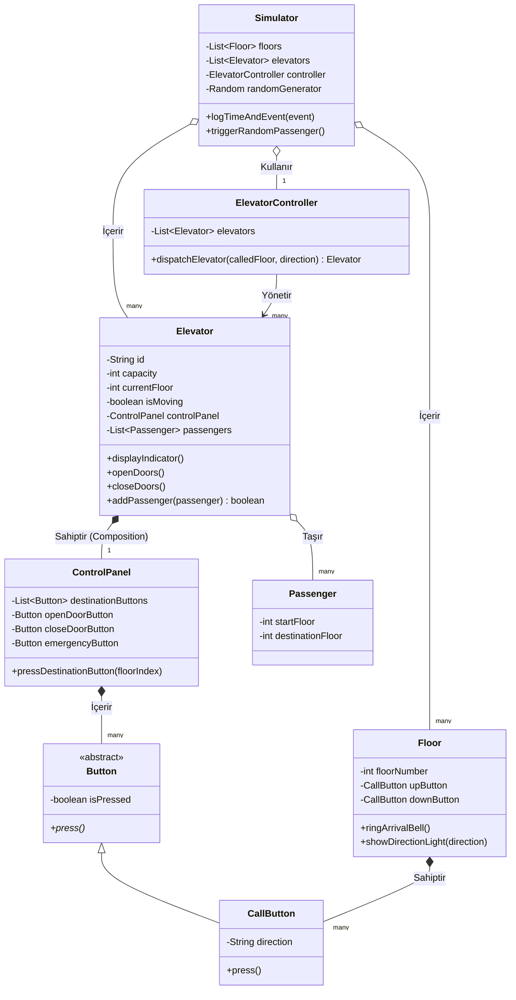

# Asansör Simülasyon Sistemi

Bu proje, bir "Kodluyoruz" sigorta firmasının 12 katlı ve 5 asansöre sahip ofisinin simülasyonudur. Nesne Yönelimli Programlama ilkelerinden **Kalıtım, Çok Biçimlilik (Polymorphism), Soyutlama ve Kapsülleme** bir arada ele alınmıştır.

## Sistemin Çalışma Özellikleri:
- Yolcular rastgele numaralarla (`Random` sınıfı) katlarda üretilir ve sistem çalışmaya başlar.
- Saat ('zaman damgası') özelliği sisteme adapte edilmiş, asansör çağrıldığında ve olay gerçekleştiğinde zaman terminale basılır. 
- Toplam 5 adet asansör, tek bir programlayıcı olan `ElevatorController` üzerinden duruma göre (`dispatchElevator()`) tahsis edilir.
- Bir `Button` sınıfı abstract (soyut) tutulup, Çağrı Butonları vb. yapılarda override edilerek **Polimorfizm** sağlanmıştır. Kapsülleme ise Private değişkenler ile elde tutulmuştur.

## Sınıf Diyagramı (UML)

Sistemin bütünsel mimarisi aşağıdaki sınıf şemasında gösterilmektedir:

