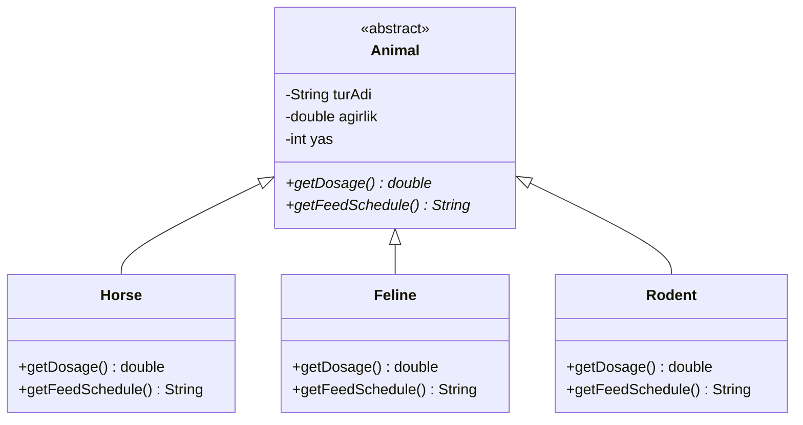

# Hayvanat Bahçesi Yönetim Sistemi

Bu proje, **Nesne Yönelimli Programlama (OOP)** prensiplerinden **Polimorfizm (Çok Biçimlilik)** konseptini örneklendirmek amacıyla tasarlanmıştır.

## Senaryo
Bir hayvanat bahçesindeki hayvanlar hakkındaki bilgileri takip etmek için kullanılan bir sistemdir.
Sistemde hayvanlar üç gruba ayrılmaktadır:
- **Atlar** (Horse)
- **Kedigiller** (Feline)
- **Kemirgenler** (Rodent)

Tüm hayvanların paylaştığı ortak özellikler (tür adı, ağırlık, yaş) `Animal` isimli soyut (abstract) bir ana sınıfta tutulmaktadır. 
Bununla birlikte, her hayvan grubunun **ilaç dozu hesaplama (`getDosage()`)** ve **yem verme saatleri (`getFeedSchedule()`)** birbirinden farklıdır. Polimorfizm sayesinde, `Animal` tipindeki herhangi bir referans üzerinden hayvanın ait olduğu grubun spesifik kuralları if/else yapıları olmadan dinamik olarak çalıştırılır.

## Sınıf Diyagramı (UML)

Aşağıdaki şema, sistemdeki sınıflar arası kalıtım (inheritance) ve metot override yapısını göstermektedir:



## Çalıştırma
Bu projeyi çalıştırmak için terminal (komut satırı) üzerinden aşağıdaki komutları kullanabilirsiniz:

```bash
# Sınıfları derleyin
javac *.java

# Ana metodu çalıştırın
java Main
```
