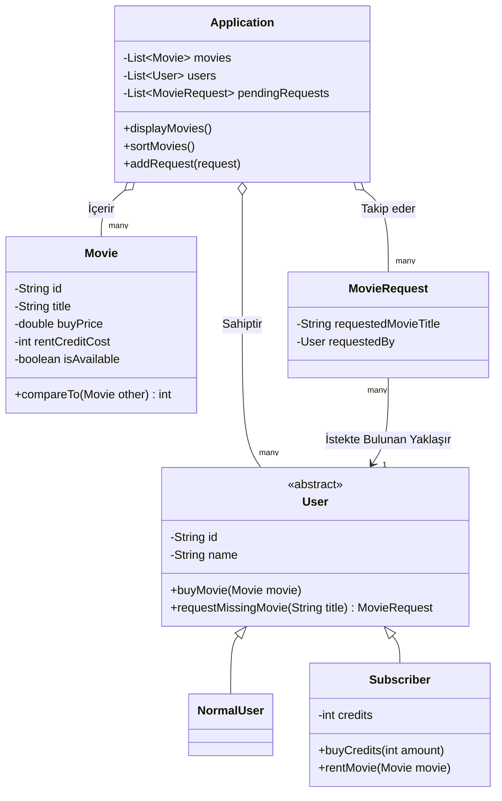

# Online Film Sistemi

Bu proje, **Nesne Yönelimli Programlama (OOP)** kullanılarak tasarlanan basit bir Online Film Uygulamasıdır. Uygulama içerisinde film satın alan normal kullanıcılar ile kredi karşılığı film kiralayabilen abonelerin rolleri farklılaştırılmış ve modelde ilgili yetkiler miras (Inheritance) bağlantılarıyla sağlanmıştır.

## Sınıf Diyagramı (UML)

Sistemin bütünsel mimarisi aşağıdaki sınıf şemasında gösterilmektedir:

## İş Kuralları ve Prensipler
1. **Inheritance (Kalıtım):** Her kullanıcının adı ve ID'si vardır. Film satın alabilir veya film sistemde yoksa `requestMissingMovie()` işlevini yerine getirebilir. Bu ortak özellikler `User` sınıfında yazıldı, `NormalUser` ve `Subscriber` bundan miras (extend) aldı.
2. **Kredi ve Kiralama:** Sadece `Subscriber` krediye (`credits`) sahiptir. Özel `rentMovie()` metodunu çağırıp hesabından bakiye düşmesini sadece Subscriber gerçekleştirebilir.
3. **Comparable:** `Movie` nesnesi kendi içerisinde `Comparable` arayüzünü (interface) uyarlandığı için sisteme doğrudan tek satırla (`Collections.sort(movies)`) kendi içerisinde alfabetik vb. sıralama yeteneğine kavuşturuldu.
