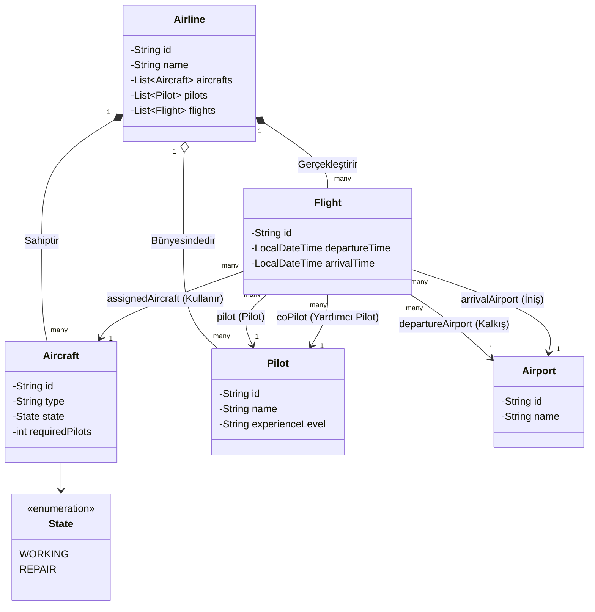

# Uçuş Yönetim Sistemi

Bu projedeki senaryo, hava yolları, pilotlar, havaalanları ve uçuşlar arasındaki ilişkiyi tasvir etmektedir. Nesne Yönelimli Tasarım (OOD - Object Oriented Design) bakımından **Association (Birliktelik)**, **Aggregation (Toplama)** ve **Composition (Oluşum)** gibi bağlantıları örneklemek için kullanılır.

## Sınıf Diyagramı (UML)

Sistemin çalışma ve birbirleriyle ilişki şeklini aşağıdan inceleyebilirsiniz:

## Modelleme Özeti:
1. **Airline (Hava Yolu)** kuruluşu sistemin merkezidir ve **Aircraft (Uçak)**, **Pilot** ile doğrudan ilişkilidir. 
2. **Flight (Uçuş)**, ilişkilerin toplandığı bir Transaction (işlem) sınıfıdır. Hangi uçak, hangi iki **Airport (Havaalanı)** arasında ve kimlerin uçuracağı uçuş nesnesini oluşturur.
3. **Aircraft** sınıfındaki *State* adlı enum (WORKING/REPAIR) ile uçakların arızalı veya çalışır durumda olduğu kolayca takip edilebilir.
