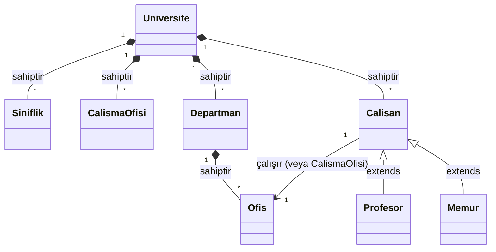

# Üniversite Yönetim Sistemi UML Diyagramı

Sistemi anlatan UML sınıf diyagramı aşağıdaki gibidir:

```mermaid
classDiagram
    Universite "1" *-- "*" Siniflik : sahiptir
    Universite "1" *-- "*" CalismaOfisi : sahiptir
    Universite "1" *-- "*" Departman : sahiptir
    Universite "1" *-- "*" Calisan : sahiptir
    
    Departman "1" *-- "*" Ofis : sahiptir
    
    Calisan "1" --> "1" Ofis : çalışır (veya CalismaOfisi)
    
    Calisan <|-- Profesor : extends
    Calisan <|-- Memur : extends

    class Universite
    class Siniflik
    class CalismaOfisi
    class Departman
    class Ofis
    class Calisan
    class Profesor
    class Memur
```
